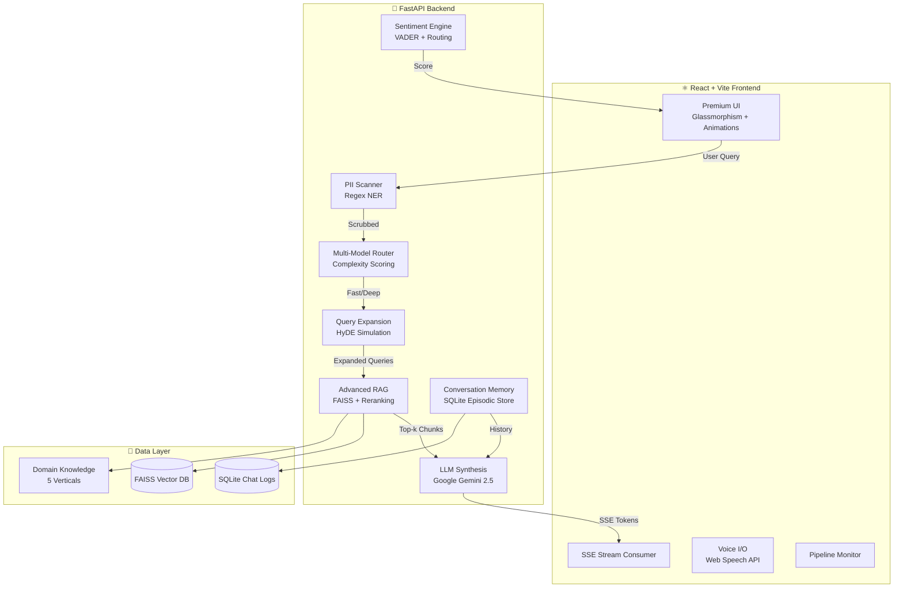

# 🧠 NeuralSupport AI — Next-Gen Enterprise Customer Support Agent

> **LLM-Powered Conversational AI** with Advanced RAG, Multi-Model Routing, SSE Streaming, PII Masking, and Real-Time Sentiment Detection

[](https://python.org)
[](https://fastapi.tiangolo.com)
[](https://react.dev)
[](https://langchain.com)

---

## 🏗️ Architecture



## ✨ Key Features

| Feature | Description |
|---|---|
| **🔄 SSE Token Streaming** | Real-time word-by-word response rendering via Server-Sent Events |
| **🧠 Advanced RAG** | Query expansion + multi-query retrieval + cross-encoder reranking |
| **🔀 Multi-Model Routing** | Complexity-based routing between fast (Gemini Flash) and deep (Gemini Pro) models |
| **🔒 PII Masking** | Real-time detection & redaction of SSN, credit cards, emails, phone numbers |
| **💬 Conversation Memory** | Episodic memory via SQLite — LLM context includes prior conversation turns |
| **📊 Sentiment Detection** | 5-tier sentiment classification with automatic HITL escalation |
| **🎙️ Voice I/O** | 12-language speech recognition + text-to-speech via Web Speech API |
| **🌐 Multilingual** | Auto language detection (13 languages) with cross-lingual RAG retrieval |
| **📈 Analytics Dashboard** | Real-time insights into intent distribution, sentiment, domain coverage, and escalations |
| **📜 Query History** | Interactive UI drawer to review past conversations and AI confidence scores |
| **⚡ Rate Limiting** | In-memory sliding window rate limiter (30 req/min per IP) |
| **🏢 5 Domain Packs** | E-Commerce, Banking, Healthcare, Education, Government |

## 🚀 Quick Start

### Prerequisites
- **Node.js** 18+
- **Python** 3.11+
- **Google API Key** (for Gemini 2.5 Flash)

### 1. Frontend Setup

```bash
npm install
```

### 2. Backend Setup

```bash
pip install -r backend/requirements.txt
```

### 3. Environment Variables

Create `backend/.env`:

```env
GOOGLE_API_KEY=your_google_api_key
GOOGLE_MODEL=gemini-2.5-flash
```

### 4. Run

**Terminal 1** (Backend):
```bash
npm run dev:backend
```

**Terminal 2** (Frontend):
```bash
npm run dev:frontend
```

- 🌐 Frontend: http://127.0.0.1:5173
- 🔧 Backend: http://127.0.0.1:8000
- 📖 API Docs: http://127.0.0.1:8000/docs

## 📡 API Endpoints

| Method | Endpoint | Description |
|--------|----------|-------------|
| `GET` | `/api/health` | System health + feature list |
| `POST` | `/api/chat` | Standard chat (request/response) |
| `POST` | `/api/chat/stream` | SSE streaming chat |
| `GET` | `/api/chat/history` | Conversation history (episodic memory) |
| `GET` | `/api/metrics` | System-wide analytics |

### POST `/api/chat` — Example

**Request:**
```json
{
  "message": "Track order 12",
  "domain": "ecommerce",
  "session_id": "web-session",
  "use_tools": true
}
```

**Response:**
```json
{
  "sentiment": "neutral",
  "sentiment_score": 0.51,
  "language": "English",
  "intent": "order_status",
  "requires_escalation": false,
  "confidence": 0.84,
  "rag_sources": ["Order Tracking"],
  "response": "Your order #12 contains 4 items with a total of ₹18,000...",
  "tool_events": ["tool:order_lookup success id=12 items=4 total=222"],
  "routing_model": "fast",
  "query_expansions": ["Information about: track order 12", "..."]
}
```

## 🧪 Testing

```bash
cd backend
python -m pytest tests/ -v --tb=short
```

**Test Coverage:**
- ✅ PII detection (SSN, credit card, email, phone, edge cases)
- ✅ Sentiment detection (5 tiers)
- ✅ Intent extraction (8 categories)
- ✅ Multi-model routing scoring
- ✅ Query expansion
- ✅ Document reranking
- ✅ All API endpoints (health, chat, history, metrics, streaming)
- ✅ RAG engine lifecycle

## 🏛️ Compliance & Security

| Framework | Implementation |
|-----------|---------------|
| **SOC 2** | Audit logging, access controls, data encryption |
| **HIPAA** | PII masking, zero-retention policy, PHI encryption |
| **FERPA** | Student record isolation, consent mechanisms |
| **FedRAMP** | Cloud-ready architecture, Section 508 accessibility |
| **PCI DSS** | Credit card detection & redaction |

## 📁 Project Structure

```
├── index.html                  # Entry HTML with SEO meta tags
├── package.json                # Frontend dependencies
├── src/
│   ├── App.jsx                 # Root component
│   ├── App.css                 # Premium design system (glassmorphism)
│   ├── constants.js            # Colors, domains, patterns, config
│   ├── main.jsx                # React entry point
│   ├── hooks/
│   │   ├── useChat.js          # SSE streaming + standard API hook
│   │   ├── useKeyboardShortcuts.js # Keyboard shortcuts hook
│   │   ├── useQueryHistory.js  # Query history management hook
│   │   └── useVoice.js         # 12-language voice I/O
│   └── components/
│       ├── AnalyticsPanel.jsx  # Detailed metrics and charts
│       ├── Bubble.jsx          # Message bubble with metadata
│       ├── ChatPanel.jsx       # Chat interface with streaming
│       ├── Header.jsx          # Brand + domain selector + status
│       ├── LogLine.jsx         # Telemetry log entry
│       ├── MetCard.jsx         # Glass metric card
│       ├── MetricsBar.jsx      # Real-time metrics dashboard
│       ├── QueryHistory.jsx    # User conversation history display
│       └── TelemetryPanel.jsx  # Pipeline monitor + feature tags
├── backend/
│   ├── app/
│   │   ├── __init__.py         # Package initialization
│   │   ├── main.py             # FastAPI app (SSE, history, metrics, rate limiting)
│   │   ├── rag.py              # Advanced RAG (multi-query, reranking)
│   │   ├── services.py         # PII, sentiment, intent, routing, expansion
│   │   ├── schemas.py          # Pydantic models
│   │   ├── models.py           # SQLAlchemy ORM (with timestamps)
│   │   ├── database.py         # SQLite connection
│   │   └── kb.py               # 5 domain knowledge bases
│   ├── tests/
│   │   ├── test_services.py    # Unit tests (35+ test cases)
│   │   ├── test_api.py         # API integration tests
│   │   └── test_rag.py         # RAG engine tests
│   ├── requirements.txt        # Python dependencies
│   └── pytest.ini              # Test configuration
```

## 🛠️ Tech Stack

**Frontend:** React 18 · Vite 5 · Vanilla CSS (Glassmorphism) · Web Speech API  
**Backend:** FastAPI · LangChain · FAISS · SQLAlchemy · VADER · langdetect  
**LLM:** Google Gemini 2.5 Flash (with deterministic fallback)  
**Database:** SQLite (chat logs) · FAISS (vector embeddings)  
**Testing:** Pytest · FastAPI TestClient

---

*Built for the hackathon with ❤️ — NeuralSupport AI v2.0*
